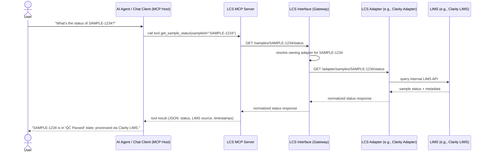

## 1. Would an MCP for LCS be beneficial?

Yes — and the fact that LCS already abstracts LIMS-specific differences behind a single API specification makes it a particularly good fit for an MCP layer. Concretely:

- **One MCP, every LIMS.** Because LCS already normalizes Clarity, iLIMS, Aquarium (and future adapters) behind one contract, an MCP built against that contract automatically works for every connected LIMS — no per-vendor MCP tooling needed. This is the same "write once, adapt many" value proposition LCS already provides, extended to AI agents.
- **Natural-language access to lab operations.** Lab techs, scientists, or support engineers could ask questions about sample/run/workflow state without needing to know LCS's REST endpoints or the underlying LIMS's UI.
- **Agentic automation.** Beyond Q&A, an MCP server can expose "tools" (not just read-only resources) so an agent could kick off a workflow, retry a failed sample, or request a report — turning LCS into an actionable surface for AI copilots, not just a data source.
- **Reduces integration debt for AI features.** Any future AI assistant (internal support bot, ILASS copilot, ops dashboard assistant) can reuse the same MCP server instead of each team writing bespoke glue code against LCS's HTTP API.
- **Strategic positioning.** It reinforces the "open, tech-stack-agnostic" story already told in your poster — MCP is itself an open, tech-stack-agnostic protocol for AI tool use, so it's a natural extension of the same architectural philosophy.

## 2. Should MCP live at the LCS interface, or at each LCS adapter?

**Recommendation: define and implement the MCP server at the LCS interface (gateway) level, not per-adapter.**

Reasoning:
- The MCP server should be just another **client of LCS**, conceptually parallel to ILASS itself — it translates MCP tool/resource calls into standard LCS API requests, and lets LCS route to whichever adapter is actually connected.
- Building MCP per-adapter re-introduces the exact **"Frankenstein" problem** you already flagged for LCS adapters themselves: each LIMS exposes different capabilities, so per-adapter MCP tooling would fragment the agent-facing surface and multiply maintenance effort per LIMS.
- A single MCP-at-the-gateway implementation gives you one consistent tool schema (e.g., `get_sample_status`, `list_workflow_runs`) regardless of whether the request ends up at Clarity, iLIMS, or Aquarium — preserving the entire point of the abstraction layer.
- The only case for adapter-level MCP exposure would be if a specific LIMS has deep, non-standardized capabilities you explicitly want to surface beyond the common LCS spec — but that should be the exception, not the default design, and would be additive rather than a replacement for the gateway-level MCP.

## 3. Sample prompts a LIMS MCP could answer

- "What's the current status of sample SAMPLE-1234?"
- "List all samples in run RUN-5678 that failed QC."
- "Show me the workflow history for library prep batch B-2025-09-01."
- "Which samples are blocked waiting on reagent lot approval?"
- "Summarize QC metrics for flow cell FC-2001."
- "Which LIMS adapters are currently online and healthy?"
- "Compare average turnaround time for samples processed via Clarity vs. iLIMS this month."
- "Retry the failed sample submission for project X."
- "What workflows are currently in progress for project ProjectAlpha?"

## 4. Sample interaction + sequence diagram

**Interaction:** A lab operations analyst asks a chat assistant, *"What's the status of sample SAMPLE-1234, and was it processed by Clarity or iLIMS?"* The MCP host (chat client) calls the LCS MCP server's `get_sample_status` tool; the MCP server calls the LCS API; LCS routes the request to whichever adapter owns that sample; the adapter queries the real LIMS; the answer flows back up and the assistant responds in natural language.

This keeps the MCP server as a thin, spec-driven translation layer sitting on the same side of the fence as ILASS — meaning any future adapter you add gets AI-agent accessibility "for free," with zero MCP-specific work.